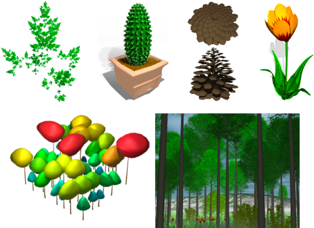

# PlantGL

_________________

[](https://plantgl.readthedocs.io/)
[](https://github.com/openalea/plantgl/actions/workflows/openalea_ci.yml?query=branch%3Amaster)
[](https://www.cecill.info/licences/Licence_CeCILL-C_V1-en.html)
[](https://anaconda.org/openalea3/openalea.plantgl)
[](https://anaconda.org/openalea3/openalea.plantgl)
[](https://anaconda.org/openalea3/openalea.plantgl)



**PlantGL** is an open-source graphic toolkit for the creation, simulation and analysis of 3D virtual plants.

Several methods are provided to create plant architectures from field measurements or from procedural algorithms. Because they reveal particularly useful in plant design and simulation, special attention has been paid to the definition and use of branching system envelops.

PlantGL is designed to be:

- **Open source**: PlantGL is an open source software and can thus be freely used and extended. Providing a standard graphic toolkit to the plant modeling community, it benefits in return of the tests and improvements of users.
- **Portable**: PlantGL is available on major operating systems (GNU Linux, Microsoft Windows). It is also compatible with various plant modeling systems (L-studio, AMAP, etc.) and graphic toolkits (Pov-Ray, Vrml, etc.).
- **Simple**: The intended audience is researchers of the plant modeling community with no knowledge in computer graphics. Researchers could create images to illustrate and explore their results.
- **Modular**: PlantGL is composed of several independent modules like a geometric library, GUI components and Python wrappers. They can be used alone or combined in a specific application.
- **Hybrid System**: Core computational components of PlantGL are implemented in the C++ compiled language for performance. In addition for flexibility of use, these components are also exported in the Python interpreted language.

## Installation

`PlantGL` distribution is based on the `conda` software environment management system.
To install conda, you may refer to its installation page: https://docs.conda.io/projects/conda/en/latest/user-guide/install/

To install PlantGL, you need to create an environment (named for instance pgl):

```bash
conda create -n pgl openalea.plantgl -c openalea3 -c conda-forge
```

The package `openalea.plantgl` is retrieved from the `fredboudon` channel (development) and its dependencies will be taken from `conda-forge` channel.

Then, you need to activate the pgl environment:

```bash
conda activate pgl
```

You can then run the PlantGL viewer:

```bash
pglviewer
```

Or use the PlantGL modules in Python:

```bash
ipython
```

```python
>>> %gui qt
>>> from openalea.plantgl.all import *
>>> Viewer.display(Sphere())
```

## Compiling

The simplest way to build PlantGL is to use conda (see below).

Then, setup your Conda environment with all required dependencies:

```bash
# Linux or macOS
conda env create -f build-util/plantgl-devel.yaml

# Windows
conda env create -f build-util/plantgl-devel-win.yaml

conda activate plantgl-devel
```

Now, you can build, then install PlantGL:

```bash
cd plantgl
mkdir build
cd build

# Linux
cmake .. -DCMAKE_INSTALL_PREFIX=${CONDA_PREFIX}

# Windows -> Visual Studio 2015 is required
cmake .. -G "NMake Makefiles" -DCMAKE_INSTALL_PREFIX=%LIBRARY_PREFIX%  ..

cmake --build . --target install --config Release

cd ..
python setup.py install --prefix=${CONDA_PREFIX}
```

You're done!

## Documentation

Documentation is available at [https://plantgl.readthedocs.io/en/latest](https://plantgl.readthedocs.io/en/latest)

### Help and Support

Please open an **Issue** if you need support or that you run into any error (Installation, Runtime, etc.).
We'll try to resolve it as soon as possible.

## Authors

PlantGL was developed by Frédéric Boudon, Christophe Pradal, Christophe Nouguier with contributions of Christophe Godin, Nicolas Dones, Boris Adam, Pierre Barbier de Reuille, etc.

## Contributors

Thanks to all that contribute making this package what it is !

<a href="https://github.com/openalea/plantgl/graphs/contributors">
  
</a>


## Citation

If you find our work useful in your research, please consider citing:

> Pradal C., Boudon F., Nouguier C., Chopard J., Godin C.. 2009. PlantGL: A python-based geometric library for 3D plant modelling at different scales. Graphical Models, 71: p. 1-21.

