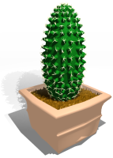
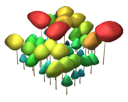
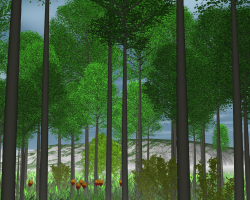

.. Do not edit. 
.. File automatically generated by sphinx_tools.py, revision 1695, on Wed Jun 24 15:29:49 2009

.. _PlantGL:

.. module:: PlantGL

PlantGL : The Plant Geometric Library
######################################

Module description
==================

.. sidebar:: Summary

    :Version: |version|
    :Release: |release|
    :Date: |today|

.. topic:: Overview

    .. include:: user/overview.txt

Illustrations
==============

.. |fig1| image:: _images/frontimages/ac4-5.png
    :scale: 30% 

.. |fig3| image:: _images/frontimages/pinecone.png
    :scale: 30%

.. centered:: |fig1| |fig2| |fig3| |fig4|
.. centered:: |fig5| |fig6|

Documentation
=============

.. toctree::
    :maxdepth: 1

    User Guide<user/index.rst>   
    
    Reference Guide<user/reference.rst>

Authors
=======

.. include:: ../AUTHORS.txt

Related Publications
====================

- PlantGL: A Python-based geometric library for 3D plant modelling at different scales. 2009. C. Pradal & F.Boudon, C.Nouguier, J.Chopard, C.Godin. Graphical Models 71. 2009. https://doi.org/10.1016/j.gmod.2008.10.001

- Déformation asymétrique de houppiers pour la génération de représentations paysagères réalistes, F. Boudon, G. Le Moguedec, Revue Electronique Francophone d’Informatique Graphique (REFIG), 1. 2007.

- Estimating the fractal dimension of plants using the two-surface method. An analysis based on 3d-digitized tree foliage. 2006. F. Boudon, C. Godin, C. Pradal, O. Puech, H. Sinoquet.  Fractals, 14c(3) 2006.

Bugs tracking
=============
You can find submit issues in the forum https://github.com/openalea/plantgl/issues 

License
=======

|PlantGL| is released under a Cecill-C License.

.. note:: `Cecill-C <http://www.cecill.info/licences/Licence_CeCILL-C_V1-en.html>`_ 
    license is a LGPL compatible license.

.. |PlantGL| replace:: OpenAlea.Plantgl
