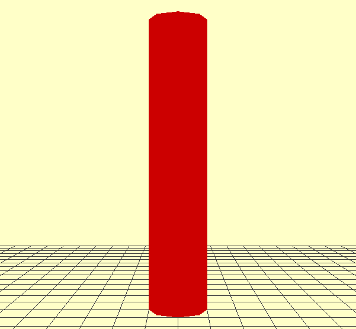
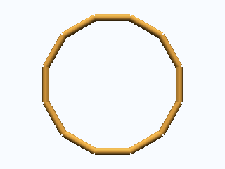

# Quickstart

Pour utiliser plantgl, lancez ipython avec l'option suivante :

```bash
ipython --gui=qt
```

> **Attention**
> Si vous n'utilisez pas cette option, vous aurez probablement des problèmes pour afficher vos résultats avec le viewer.

Pour importer tous les modules de plantgl :

```python
from openalea.plantgl.all import *
```

## Scene creation

Les différentes primitives de PlantGL sont assemblées dans un objet de graphe de scène. Pour créer un tel objet :

```python
scene = Scene()
```

## Create a shape

Certaines primitives peuvent être instanciées avec des informations de matériau. Par exemple, un cylindre rouge :

```python
c = Cylinder(1, 10)
color = Material(Color3(255,0,0),0,Color3(0,0,0),Color3(0,0,0),1,0)
shape = Shape(c, color)
```

Voir aussi : [tutorial.md](./tutorial.md)

## Visualize the scene

La forme colorée peut être ajoutée à la scène et visualisée via le Viewer :

```python
scene.add(shape)
Viewer.display(scene)
```

## Output

Il est possible de sauvegarder la vue courante dans un fichier PNG. La couleur du fond et les grilles peuvent être définies ainsi :

```python
Viewer.frameGL.setBgColor(255,255,200)
Viewer.grids.setXYPlane(True)
Viewer.grids.setYZPlane(False)
Viewer.grids.setXZPlane(False)
Viewer.frameGL.saveImage("_images/result.png")
```

{ width="50%" }

## Applying Algorithms

De nombreux algorithmes sont définis et peuvent être appliqués à la représentation géométrique créée. Par exemple, pour calculer la bounding box de la scène :

```python
bbc = BBoxComputer()
scene.apply(bbc)
boundingbox = bbc.result
```

De nombreux algorithmes ont été implémentés comme Action et s'adaptent à la structure spécifique de chaque graphe de scène.

## Turtle Geometry

Pour assembler facilement différentes formes de façon itérative, la géométrie turtle a été introduite dans PlantGL. Pour l'utiliser, créez un objet turtle qui enregistrera les différentes actions de dessin pour produire une représentation finale. Par exemple, pour produire un tore :

```python
turtle = PglTurtle()
for i in range(12):
    turtle.left(30).F(1)
scene = turtle.getScene()
Viewer.display(scene)
```

{ width="40%" }
