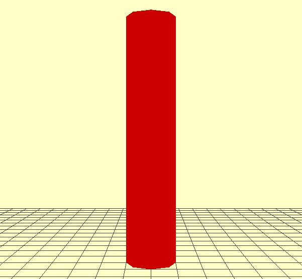
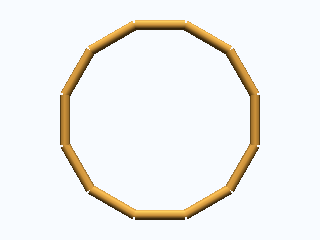

# Quickstart

To use plantgl, run ipython as follows:

```bash
ipython --gui=qt
```

> **Warning**
> The option `--gui=qt` is mandatory to display correctly into the plantgl viewer.

Import all modules:

```python
from openalea.plantgl.all import *
```

## Scene creation

The different PlantGL primitives are assembled into a scene graph object. To create such an object:

```python
scene = Scene()
```

## Create a shape

Some primitives can be instantiated with material properties. For example, a red cylinder:

```python
c = Cylinder(1, 10)
color = Material(Color3(255,0,0),0,Color3(0,0,0),Color3(0,0,0),1,0)
shape = Shape(c, color)
```

See also: [tutorial.md](./tutorial.md)

## Visualize the scene

This form can be added to the scene using the Viewer:

```python
scene.add(shape)
Viewer.display(scene)
```

## Output

The actual view can be saved into PNG format. Background color and grid can be set as follows:

```python
Viewer.frameGL.setBgColor(255,255,200)
Viewer.grids.setXYPlane(True)
Viewer.grids.setYZPlane(False)
Viewer.grids.setXZPlane(False)
Viewer.frameGL.saveImage("_images/result.png")
```

{ width="50%" }

## Applying Algorithms

Several algorithms can be applied to the scene. For example, to calculate the scene bounding box:

```python
bbc = BBoxComputer()
scene.apply(bbc)
boundingbox = bbc.result
```

## Turtle Geometry

To easily assemble different shapes in an iterative way, turtle geometry was introduced in PlantGL. To use it, create a turtle object that will record the various drawing actions to produce a final representation. For example, to produce a torus:

```python
turtle = PglTurtle()
for i in range(12):
    turtle.left(30).F(1)
scene = turtle.getScene()
Viewer.display(scene)
```

{ width="40%" }
