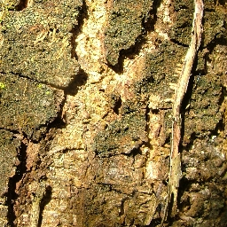
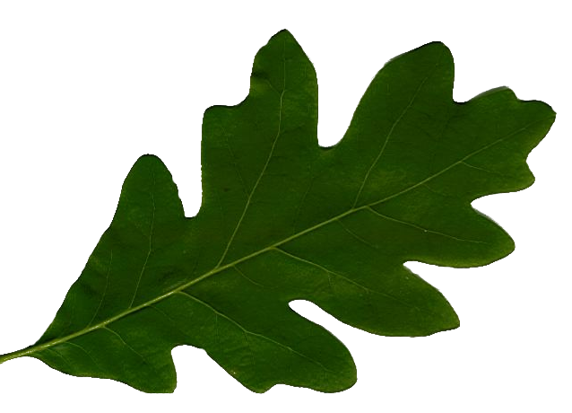
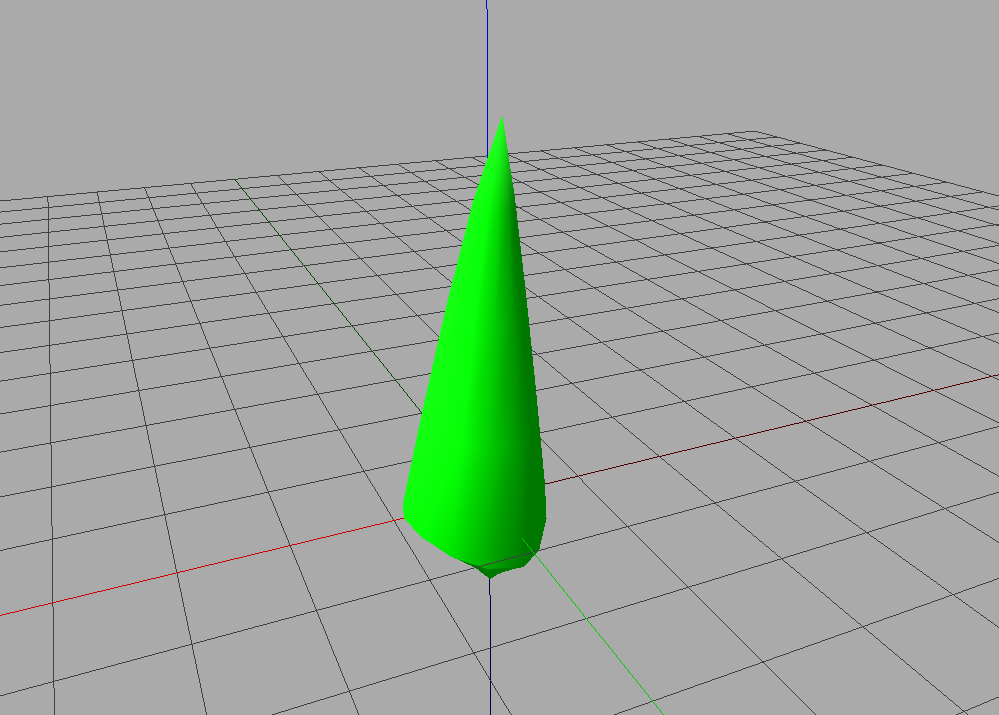
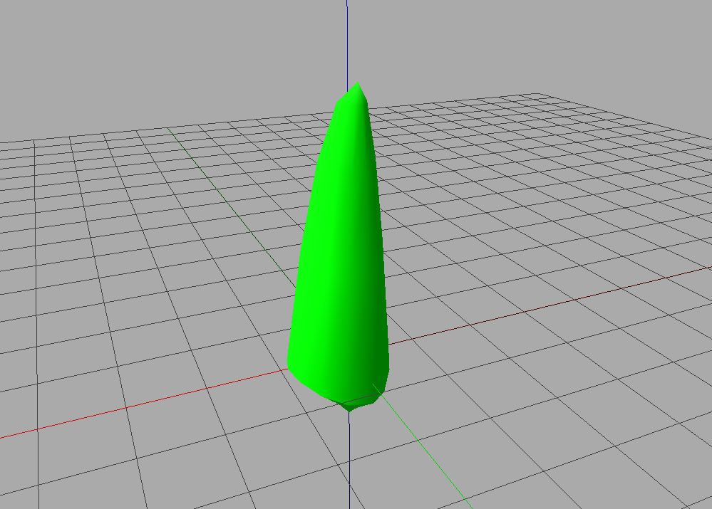
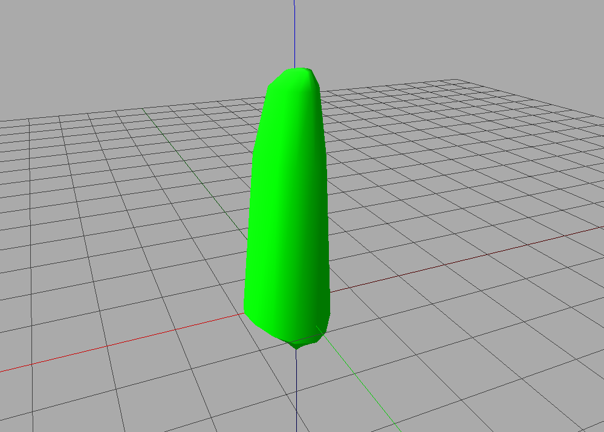
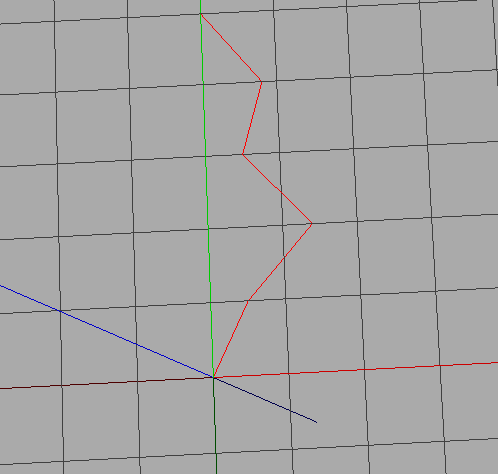
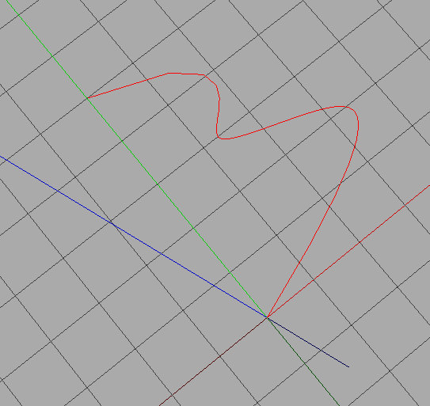
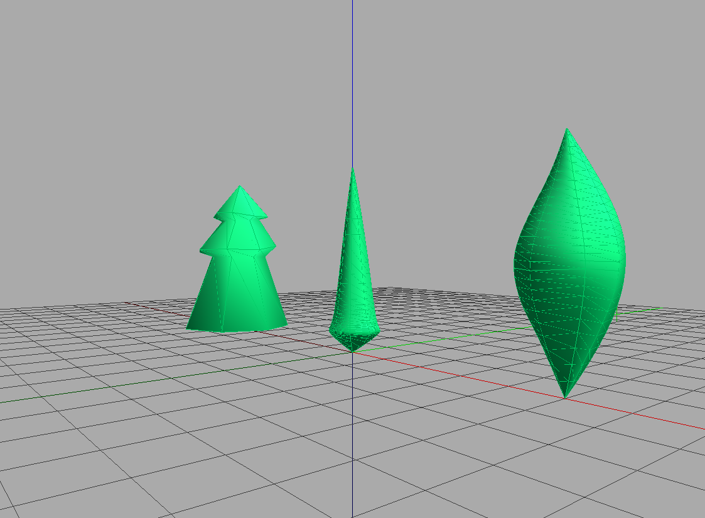
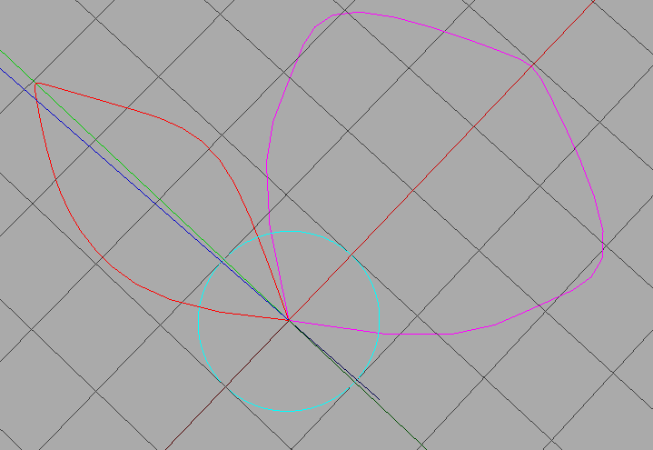

# Tutorial on the creation of geometric content

## First step

Pour réaliser ces exercices, lancez ipython avec l'option suivante :

```bash
ipython --gui=qt
```

> **Attention**
> Si vous n'utilisez pas cette option, vous aurez probablement des problèmes pour afficher vos résultats avec le viewer.

Importez tous les modules de plantgl :

```python
from openalea.plantgl.all import *
```

---

## Exercises

### Hello World

1. Utilisez l'aide sur la primitive `Box`. Quels sont les arguments possibles du constructeur ?
2. Consultez la [documentation plantgl sur le web](http://www-sop.inria.fr/virtualplants/doc/plantgl-2.6/).
3. Créez une `Sphere` de rayon 5.
4. Affichez-la dans le `Viewer`.

Votre résultat devrait ressembler à :

{ width="40%", align="center" }

> **Note**
> Dans le viewer, vous pouvez changer l'angle de la caméra par glisser-déposer, changer la direction de la lumière en maintenant `ctrl` et glisser-déposer, et zoomer/dézoomer avec la molette.

[Solution pour Hello World](#solution-pour-hello-world)

---

### Material

Créez une forme avec la sphère précédente et associez-lui un matériau rouge.

{ width="40%", align="center" }

*Astuce* : Utilisez `Shape` et `Material`.

[Solution pour Material](#solution-pour-material)

---

### Transformation

Créez une `Sphere` centrée au point (-2,0,0).

{ width="40%", align="center" }

*Astuce* : Utilisez l'aide sur `Translated`.

[Solution pour Transformation](#solution-pour-transformation)

---

### Scene

Affichez une scène avec deux sphères, une rouge et une jaune, positionnées respectivement en (-5,0,0) et (-2,0,1).

{ width="40%", align="center" }

*Astuce* : Utilisez l'aide sur `Scene`.

[Solution pour Scene](#solution-pour-scene)

---

### Instantiation

Dans la scène précédente, utilisez la même primitive sphère pour les translations. Changez le rayon de la sphère et observez l'effet sur la scène.

{ width="40%", align="center" }

[Solution pour Instantiation](#solution-pour-instantiation)

---

### Mesh

1. Créez un carré avec `QuadSet`.
2. Ajoutez différentes couleurs aux sommets du carré.
3. Créez un cube avec `QuadSet` et des couleurs différentes pour chaque face.
4. Créez un cube avec `QuadSet` et une couleur différente pour chaque point de chaque face.

{ width="40%" }
{ width="40%" }
{ width="40%" }
{ width="40%" }

[Solution pour Mesh](#solution-pour-mesh)

---

### Texture and Billboard

1. Ajoutez des coordonnées de texture aux sommets du carré pour afficher une image :

    { width="20%", align="center" }

   *Astuce* : Créez une `Shape` avec votre carré comme géométrie et `ImageTexture` comme matériau.
2. Utilisez la transparence pour afficher une feuille sur un carré :

    { width="20%", align="center" }

3. Affichez la texture bois sur le carré mais seulement une partie de l'image (moitié largeur/hauteur à partir de 1/4,1/4).
4. Affichez toujours la même image sur les 6 faces d'un cube.
5. Créez une croix avec 5 carrés et affichez une partie de la texture sur chaque carré.

Résultats :

{ width="40%" }
{ width="40%" }
{ width="40%" }
{ width="40%" }
{ width="40%" }

[Solution pour Texture and Billboard](#solution-pour-texture-and-billboard)

---

### Discretisation

1. Créez un `QuadSet` correspondant à un cylindre.
2. Créez un `TriangleSet` correspondant à un cylindre.
3. (Difficile) Créez une `Sphere` comme un icosaèdre tronqué.

Résultats :

{ width="40%" }
{ width="40%" }

[Solution pour Discretisation](#solution-pour-discretisation)

---

### Hulls

1. Créez une fonction python pour afficher un `AsymmetricHull` croissant.

    { width="40%" }
    { width="40%" }
    { width="40%" }
    { width="40%" }

2. Créez des profils avec coordonnées x positives avec `Polyline2D`, `BezierCurve2D`, `NurbsCurve2D`.

    { width="40%" }
    { width="40%" }
    { width="40%" }

3. Créez un `Swung` hull avec les profils précédents à différents angles entre [0;2*pi].

    { width="40%", align="center" }

4. Créez un cercle avec `Polyline2D.Circle` et un profil fermé représentant la silhouette d'un arbre.

    { width="40%", align="center" }

5. Avec ces deux profils, créez un `ExtrudedHull` pour obtenir :

    { width="40%", align="center" }

[Solution pour Hulls](#solution-pour-hulls)

---

### Generalized Cylinder

Avec un cercle et une ligne 3D, créez une branche avec une `Extrusion`. Résultat attendu :

{ width="40%", align="center" }

[Solution pour Generalized Cylinder](#solution-pour-generalized-cylinder)

---

### Positioning objects

1. Créez un tronc de 2 mètres avec un cylindre et des paires de feuilles latérales tous les 50 cm.
   *Astuce* : Utilisez `Translated`, `AxisRotated`, `EulerRotated`, etc.
2. Même chose avec des feuilles de taille décroissante.
   *Astuce* : Utilisez `Scaled`.
3. Même chose avec un tronc coudé de 30° au milieu.

{ width="30%" }
{ width="30%" }
{ width="30%" }

*Astuce* : Faites attention à l'ordre des transformations !

[Solution pour Positioning Objects](#solution-pour-positioning-objects)

---

## Solutions

### Solution pour Hello World

Script python pour obtenir l'aide sur `Box` :

```python
# solutions_python/box.py
```

Les arguments pour initialiser une `Box` sont les échelles x, y et z. Pour créer une sphère de rayon 5 :

```python
# solutions_python/sphere_5.py
```

{ width="40%", align="center" }
{ width="40%", align="center" }

---

### Solution pour Material

Pour associer un matériau rouge à une sphère :

```python
# solutions_python/material.py
```

{ width="40%", align="center" }

---

### Solution pour Transformation

Pour translater une sphère :

```python
# solutions_python/transformation.py
```

{ width="40%", align="center" }

---

### Solution pour Scene

Pour créer une scène avec deux sphères différentes :

```python
# solutions_python/scene.py
```

{ width="40%", align="center" }

---

### Solution pour Instantiation

Pour utiliser la même primitive sphère dans la scène :

```python
# solutions_python/scene2.py
```

{ width="40%", align="center" }

---

### Solution pour Mesh

Carré coloré :

```python
# solutions_python/carre.py
```

{ width="40%", align="center" }

Cube avec couleur par face :

```python
# solutions_python/cube.py
```

{ width="40%", align="center" }

Cube avec couleur par sommet :

```python
# solutions_python/cube2.py
```

{ width="40%", align="center" }

---

### Solution pour Texture and Billboard

Carré texturé :

```python
# solutions_python/square_tex.py
```

{ width="40%", align="center" }

Carré texturé avec alpha :

```python
# solutions_python/square_tex2.py
```

{ width="40%", align="center" }

Carré texturé partiellement :

```python
# solutions_python/square_tex3.py
```

{ width="40%", align="center" }

Cube texturé :

```python
# solutions_python/cube_tex.py
```

{ width="40%", align="center" }

Croix texturée :

```python
# solutions_python/cross_tex.py
```

{ width="40%", align="center" }

---

### Solution pour Discretisation

Cylindre avec QuadSet :

```python
# solutions_python/cyl_quadset.py
```

{ width="40%", align="center" }

Cylindre avec TriangleSet :

```python
# solutions_python/cyl_triangleset.py
```

{ width="40%", align="center" }

---

### Solution pour Hulls

Hulls croissants :

```python
# solutions_python/asymmetric_hulls.py
```

{ width="40%", align="center" }

Swung hulls :

```python
# solutions_python/hull_profil.py
```

{ width="40%", align="center" }

Extruded hulls :

```python
# solutions_python/hull_extruded.py
```

{ width="40%", align="center" }

---

### Solution pour Generalized Cylinder

Branches extrudées :

```python
# solutions_python/branches.py
```

{ width="40%", align="center" }

---

### Solution pour Positioning Objects

Arbre avec feuilles de même taille :

```python
# solutions_python/tree1.py
```

{ width="40%", align="center" }

Arbre avec feuilles de taille décroissante :

```python
# solutions_python/tree2.py
```

{ width="40%", align="center" }

Arbre avec tronc coudé :

```python
# solutions_python/tree3.py
```

{ width="40%", align=