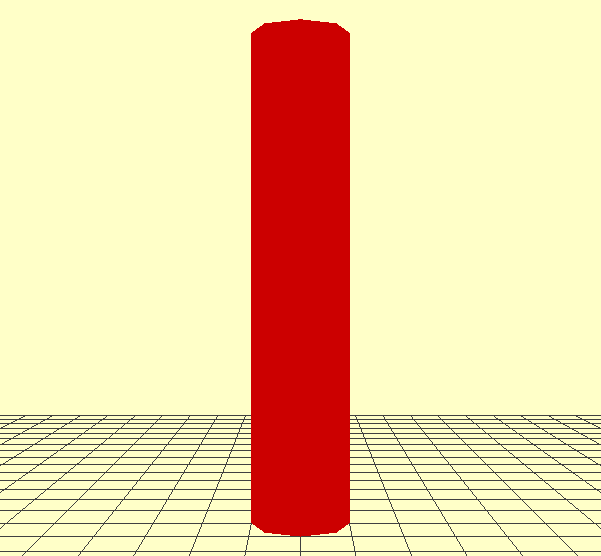

Quickstart
===========

To use plantgl, you must launch ipython with the following option ::

   terminal_linux:~$ ipython --gui=qt

.. warning::
    If you do not use this option, you will certainly have problems if you want to display your results with the viewer.

To import all the modules from plantgl ::

   from openalea.plantgl.all import *

Scene creation
--------------

The different primitives of PlantGL are assembled into a scene graph object. To create such object:

.. code:: python

    scene = Scene()

Create a shape
---------------

Some primitives can be instanciated with given material information. As an example , a red Cylinder can be created using the following code:

.. code:: python

    c = Cylinder(1, 10)
    color = Material(Color3(255,0,0),0,Color3(0,0,0),Color3(0,0,0),1,0)
    shape = Shape(c, color)

.. seealso:: tutorial.rst  

Visualize the scene
-------------------

The colored shape can be added to the scene and visualize via the Viewer:
 
.. code:: python

    scene.add(shape)
    Viewer.display(scene)

Output
------

Finally, it is possible to save the current view in a PNG file. First, the background color and grids can be set using the following commands:

.. code:: python

    Viewer.frameGL.setBgColor(255,255,200)
    Viewer.grids.setXYPlane(True)
    Viewer.grids.setYZPlane(False)
    Viewer.grids.setXZPlane(False)
    Viewer.frameGL.saveImage("user/result.png")

Applying Algoirthms
-------------------
A number of algorithms are defined and can be applied to the geometric representation that have been created.
For instance, to compute the boundingbox of the scene

.. code:: python

    bbc = BBoxComputer()
    scene.apply(bbc)
    boundingbox = bbc.result

Numerous algorithms have been implemented as Action that adapt to the specific structure of each scene graph.

Turtle Geometry
---------------

To assemble iterativelly and easily different shapes, the turtle geometry have been introduced in PlantGL. To use it, a turtle object 
has to be created that will register the different drawing actions to produce a final representation. For instance to produce a torus

.. code:: python

    turtle = PglTurtle()
    for i in range(12):
         turtle.left(30).F(1)
    scene = turtle.getScene()
    Viewer.display(scene)

.. image:: torus.png
    :width: 50%

