Tutorial on the creation of geometric content 
=============================================
First step
**********
To make these exercises, you must launch ipython with the following option ::

   terminal_linux:~$ ipython --gui=qt

.. warning::
    If you do not use this option, you will certainly have problems if you want to display your results with the viewer.

Now you must import all modules from plantgl ::

   from openalea.plantgl.all import *

Exercises
*********

Hello World
-----------

#. Invoke help on the :class:`Box <openalea.plantgl.scenegraph._pglsg.Box>` primitive, what are the possible constructor arguments ? 
#. Look at the `plantgl doc on the web <http://www-sop.inria.fr/virtualplants/doc/plantgl-2.6/>`_.
#. Create a :class:`Sphere <openalea.plantgl.scenegraph._pglsg.Sphere>` of radius 5.
#. Display it on the :class:`Viewer <openalea.plantgl.gui._pglgui.Viewer>`.

Your result should be :

.. image:: ../_images/sphere_5.png
    :width: 40%
    :align: center

.. note:: In the viewer, you can change the camera angle by drag and drop, change the light direction by pressing `ctrl` and drag and drop, and get closer or further by scrolling.

`Solution for Hello World`_

Material
--------

Create a shape with the previous sphere to associate a red material.

Your result should be :

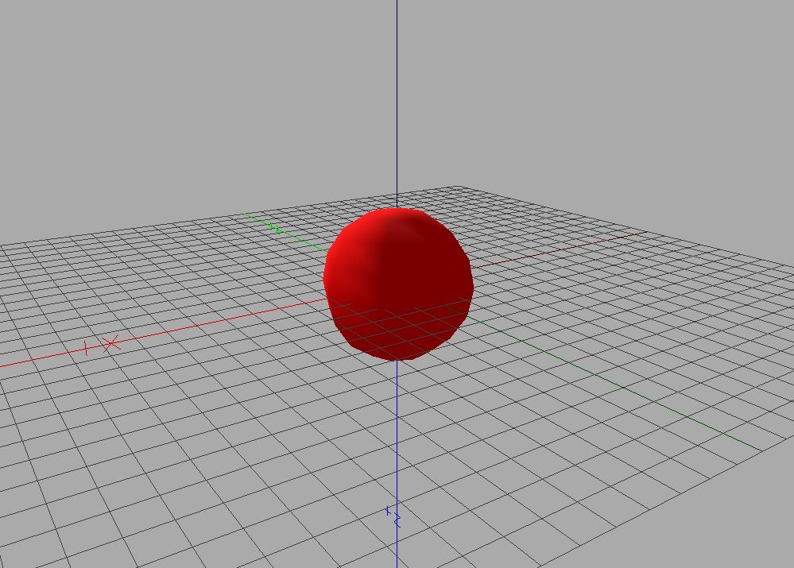

*Hint* : Use :class:`Shape <openalea.plantgl.scenegraph._pglsg.Shape>` and :class:`Material <openalea.plantgl.scenegraph._pglsg.Material>`.

`Solution for Material`_

Transformation
--------------

Create a :class:`Sphere <openalea.plantgl.scenegraph._pglsg.Sphere>` centered at point (-2,0,0).

Your result should be :

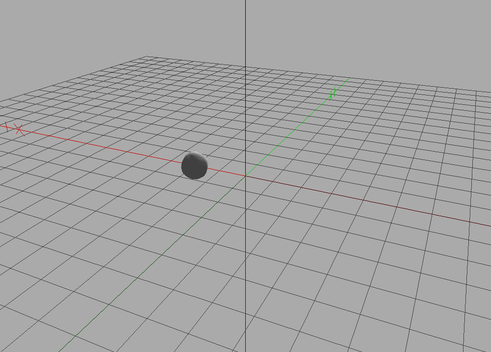

*Hint* : Invoke help on :class:`Translated <openalea.plantgl.scenegraph._pglsg.Translated>`.

`Solution for Transformation`_

Scene
-----

Display a scene with two spheres, one red, one yellow, respectively positioned at (-5,0,0) and (-2,0,1).

Your result should be :

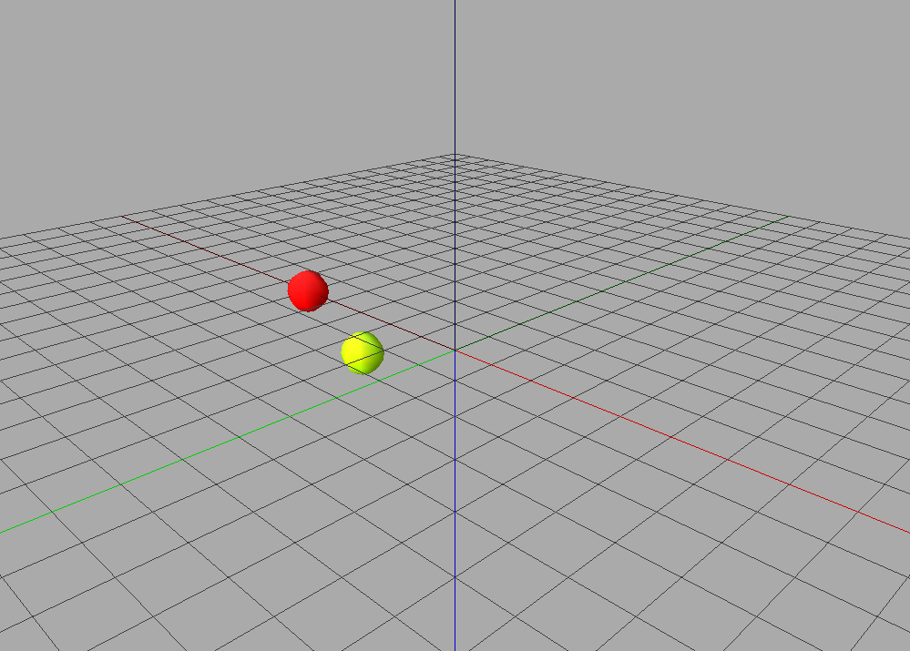

*Hint* : Invoke help on :class:`Scene <openalea.plantgl.scenegraph._pglsg.Scene>`.

`Solution for Scene`_

Instantiation
-------------

In the previous scene, use the same sphere primitive for the translations. Change the radius of the sphere and observe the effect on the scene.

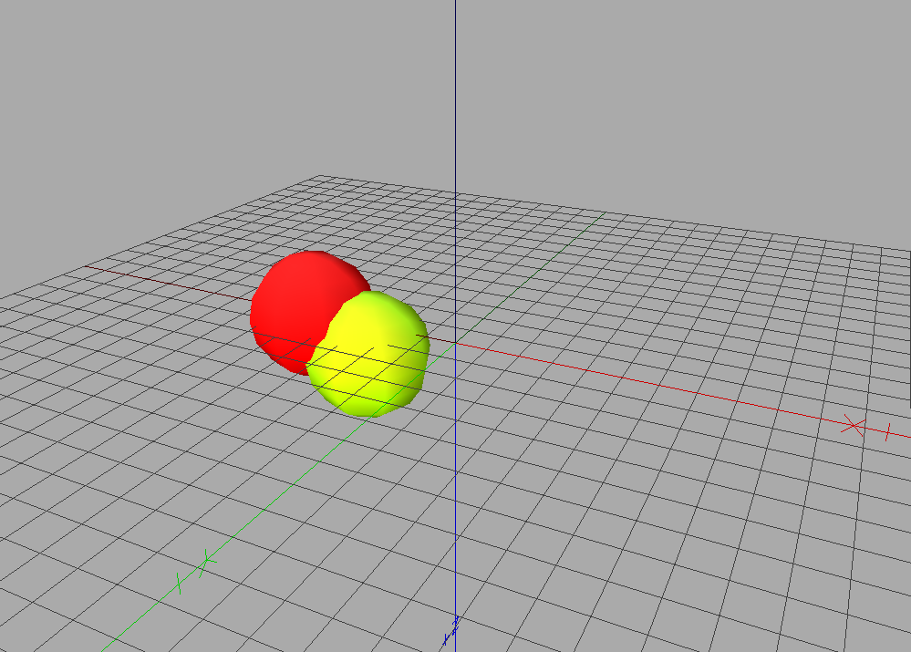

`Solution for Instantiation`_

Mesh
----

#. Create a square with :class:`QuadSet <openalea.plantgl.scenegraph._pglsg.QuadSet>`
#. Add different colors to the vertices of the square in the quadset
#. Create a box with :class:`QuadSet <openalea.plantgl.scenegraph._pglsg.QuadSet>` with different colors for each face
#. Create a box with :class:`QuadSet <openalea.plantgl.scenegraph._pglsg.QuadSet>` with a different color associated to each point in each face 

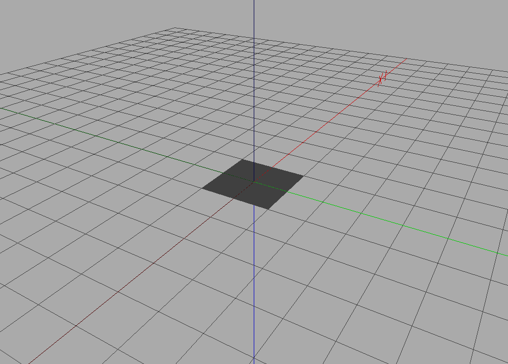

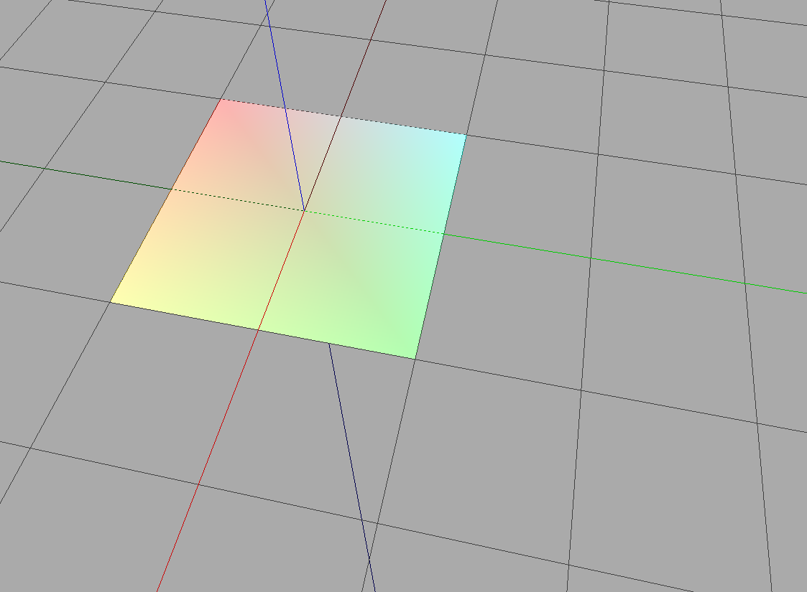

.. image:: ../_images/cube1.png
    :width: 40%

.. image:: ../_images/cube2.png
    :width: 40%

`Solution for Mesh`_

Texture and Billboard
---------------------

#. Add texture coordinates to the vertices of the square in the :class:`QuadSet <openalea.plantgl.scenegraph._pglsg.QuadSet>` to display an image. You can use this image :

    .. image:: solutions_python/textures/wood_texture.png
        :width: 20%
        :align: center
   
   *Hint* : Create a :class:`Shape <openalea.plantgl.scenegraph._pglsg.Shape>` with your square as a geometry and :class:`ImageTexture <openalea.plantgl.scenegraph._pglsg.ImageTexture>` as a material.
#. Use transparency to display a leaf onto a square . You can use for instance this image :

    .. image:: solutions_python/textures/leaf_tex.png
        :width: 20%
        :align: center

#. Display the wood texture on the square but only a part of the picture (half of its width and height starting from 1/4,1/4). 

#. Display always the same image (with same orientation!) on the 6 faces of a cube. 
#. Create a cross like shape with 5 squares using :class:`QuadSet <openalea.plantgl.scenegraph._pglsg.QuadSet>` and display part of the texture on each square.

You should have as results :

.. image:: ../_images/tex1.png
    :width: 40%

.. image:: ../_images/tex2.png
    :width: 40%

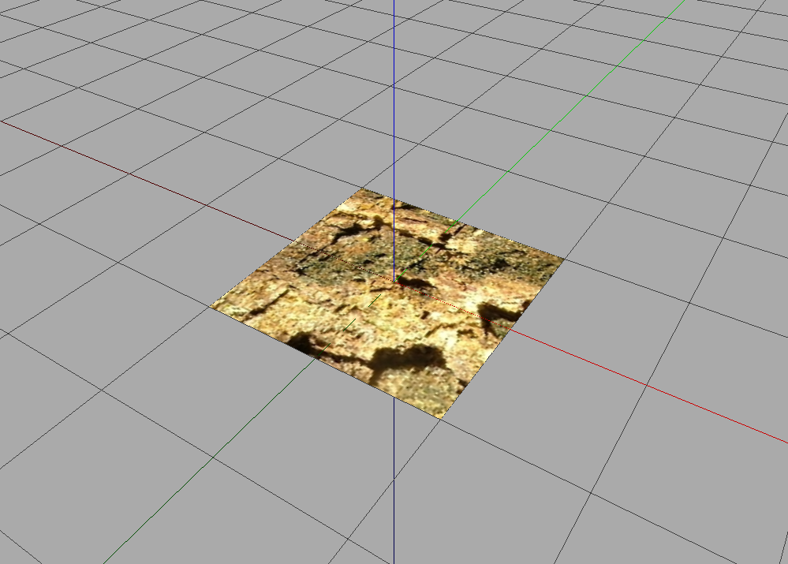

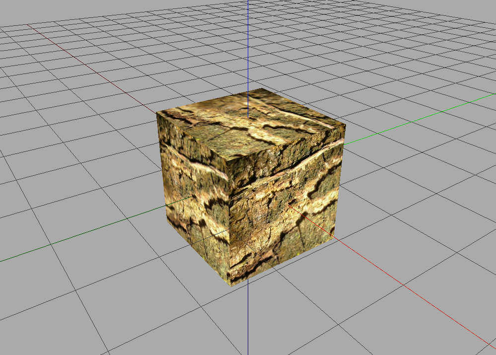

.. image:: ../_images/tex5.png
    :width: 40%

`Solution for Texture and Billboard`_

Discretisation
--------------

#. Create a :class:`QuadSet <openalea.plantgl.scenegraph._pglsg.QuadSet>` corresponding to a cylinder
#. Create a :class:`TriangleSet <openalea.plantgl.scenegraph._pglsg.TriangleSet>` corresponding to a cylinder
#. (Difficult) Create a :class:`Sphere <openalea.plantgl.scenegraph._pglsg.Sphere>` as a truncated icosahedron

Your results should be alike this :

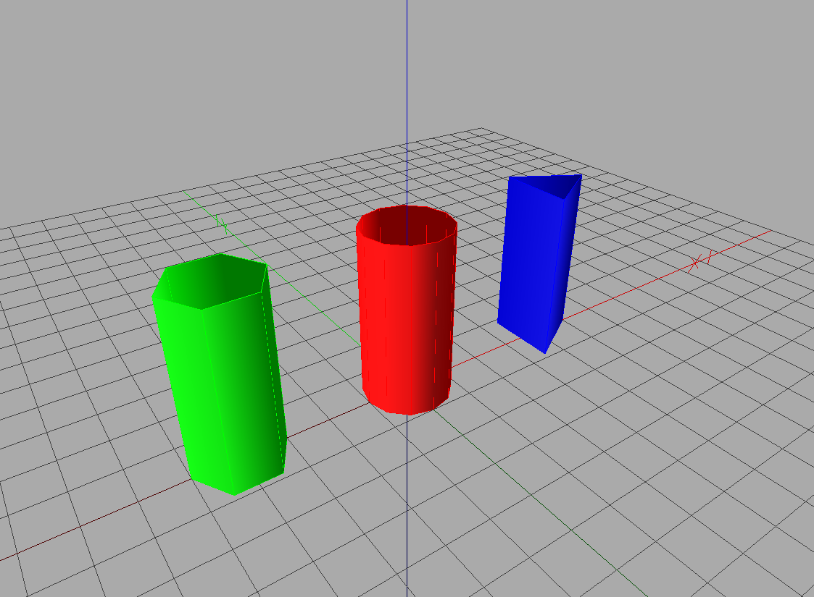

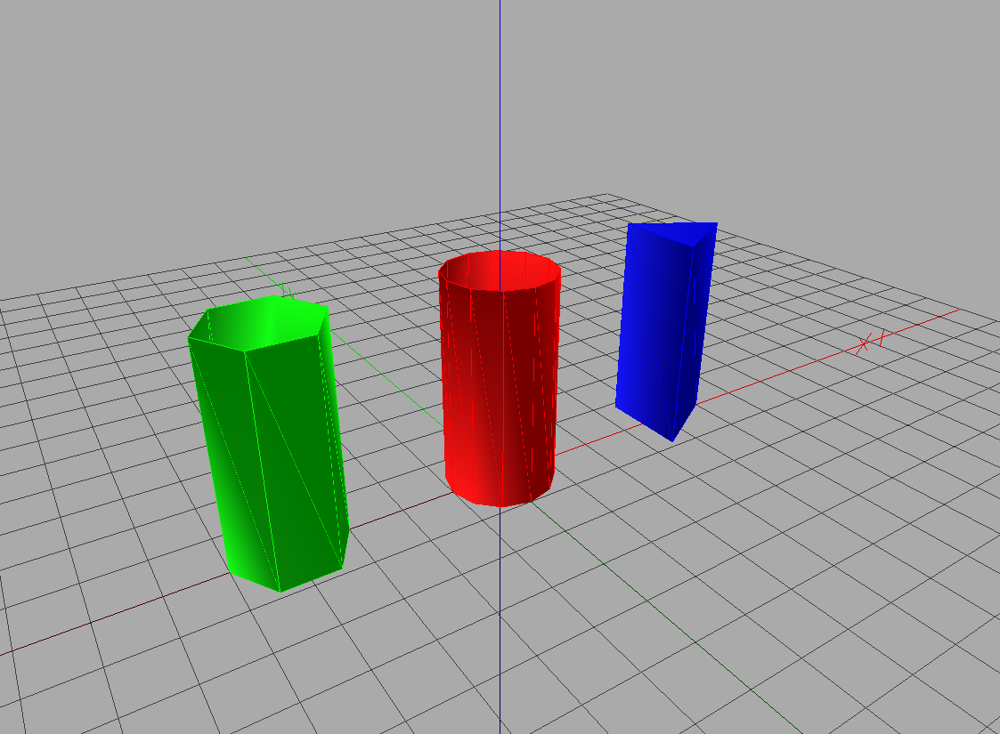

`Solution for Discretisation`_

Hulls
-----

#. Create python function to display a growing :class:`AsymmetricHull <openalea.plantgl.scenegraph._pglsg.AsymmetricHull>`

    .. image:: ../_images/asym_hull1.png
        :width: 40%
   
    .. image:: ../_images/asym_hull2.png
        :width: 40%

    .. image:: ../_images/asym_hull3.png
        :width: 40%

    .. image:: ../_images/asym_hull4.png
        :width: 40%

#. Create profiles with positive x coordinates with :class:`Polyline2D <openalea.plantgl.scenegraph._pglsg.Polyline2D>`, :class:`BezierCurve2D <openalea.plantgl.scenegraph._pglsg.BezierCurve2D>`, :class:`NurbsCurve2D <openalea.plantgl.scenegraph._pglsg.NurbsCurve2D>`

    .. image:: ../_images/polyline.png
        :width: 40%

    .. image:: ../_images/beziercurve.png
        :width: 40%

    .. image:: ../_images/nurbscurve.png
        :width: 40%

#. Create a :class:`Swung <openalea.plantgl.scenegraph._pglsg.Swung>` hull with previous profiles positioned at different angles between [0;2*pi] to get something like

    .. image:: ../_images/profile_hulls.png
        :width: 40%
        :align: center

#. Create a circle with `Polyline2D.Circle` and a closed profile representing silhouette of a tree.

    .. image:: ../_images/hulls_circle.png
        :width: 40%
        :align: center

#. With these 2 profiles, create an :class:`ExtrudedHull <openalea.plantgl.scenegraph._pglsg.ExtrudedHull>` to get something looking like :

    .. image:: ../_images/extruded_hulls.png
        :width: 40%
        :align: center

`Solution for Hulls`_

Generalized Cylinder
--------------------

With a circle and 3D line create a branch with an :class:`Extrusion <openalea.plantgl.scenegraph._pglsg.Extrusion>`. Your result should be something like : 

.. image:: ../_images/branches.png
    :width: 40%
    :align: center

`Solution for Generalized Cylinder`_

Positioning objects
--------------------

#. Create a trunk of 2 meter with a cylinder and regular lateral pair of leaves at every 50 cm. 
   *Hints* : Use :class:`Translated <openalea.plantgl.scenegraph._pglsg.Translated>`, :class:`AxisRotated <openalea.plantgl.scenegraph._pglsg.AxisRotated>`, :class:`EulerRotated <openalea.plantgl.scenegraph._pglsg.EulerRotated>`, etc.

#. Same with size of leaves diminishing. 
   *Hints* : Use :class:`Scaled <openalea.plantgl.scenegraph._pglsg.Scaled>`.

#. Same with a trunk with an elbow of 30 degree in the middle.

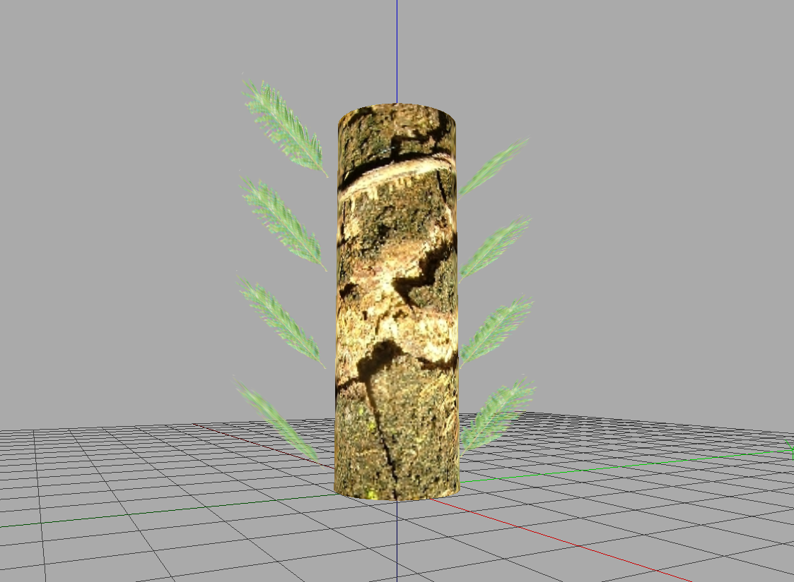

.. image:: ../_images/tree2.png
    :width: 30%

.. image:: ../_images/tree3.png
    :width: 30%

*Hints* : Take care of the order in which the transformations are performed ! 

`Solution for Positioning Objects`_

----------------------------------------------------------------------------------------------------------------------

Solutions
*********

Solution for Hello World
-------------------------

The python script to get help on :class:`Box <openalea.plantgl.scenegraph._pglsg.Box>` is

.. literalinclude:: solutions_python/box.py

Thanks to the help, we see that args for initializing a :class:`Box <openalea.plantgl.scenegraph._pglsg.Box>` are the scaling in all 3 directions x, y and z. We call it and display it to obtain as a result :

.. image:: ../_images/box.png
    :width: 40%
    :align: center

And then to create the :class:`sphere <openalea.plantgl.scenegraph._pglsg.Sphere>` of radius 5, we call

.. literalinclude:: solutions_python/sphere_5.py

To obtain

.. image:: ../_images/sphere_5.png
    :width: 40%
    :align: center

Solution for Material
---------------------

To associate a red :class:`material <openalea.plantgl.scenegraph._pglsg.Sphere>` to a :class:`sphere <openalea.plantgl.scenegraph._pglsg.Sphere>`, the python script is :

.. literalinclude:: solutions_python/material.py

and the resulting image is :

Solution for Transformation
---------------------------

To :class:`translate <openalea.plantgl.scenegraph._pglsg.Translated>` a :class:`sphere <openalea.plantgl.scenegraph._pglsg.Sphere>`, the python script is :

.. literalinclude:: solutions_python/transformation.py

and the resulting image is :

Solution for Scene
------------------

To make a :class:`scene <openalea.plantgl.scenegraph._pglsg.Scene>` with two different :class:`spheres <openalea.plantgl.scenegraph._pglsg.Sphere>`, the python script is :

.. literalinclude:: solutions_python/scene.py

and the resulting image is :

Solution for Instantiation
--------------------------

To make a :class:`scene <openalea.plantgl.scenegraph._pglsg.Scene>` with two different :class:`spheres <openalea.plantgl.scenegraph._pglsg.Sphere>` from the same sphere primitive, the python script is :

.. literalinclude:: solutions_python/scene2.py

and the resulting image is :

Solution for Mesh
-----------------

To get the :class:`square <openalea.plantgl.scenegraph._pglsg.QuadSet>` with colors to each vertex, the python script is:

.. literalinclude:: solutions_python/carre.py

and the resulting image is:

.. image:: ../_images/quadset.png
    :width: 40%
    :align: center

The list of points indicates the coordinates of the vertices, each tuple of indices indicates which point are used for a specific quad, linked in the given order. We set the normals, indicate colors and associate with indices each color to a different vertex.

Now we compute a cube with a color for each face. The python script is:

.. literalinclude:: solutions_python/cube.py

for the result :

.. image:: ../_images/cube1.png
    :width: 40%
    :align: center

We define a list of 8 vertices, then a list of squares using those vertices. Then we define a list of 6 colors, and the color indices allow to associate a color for a vertex in a given square. For the first square, vertex v1 is associated with color 0, for the second square it is associated to color 1, for the third adjacent square it is associated with color 4. If you let colorIndexList to default (to none), a color must be associated to each vertex.

If we want to compute now a cube with, for each face, a color per vertex, we will use the python script :

.. literalinclude:: solutions_python/cube2.py

for the result :

.. image:: ../_images/cube2.png
    :width: 40%
    :align: center

Solution for Texture and Billboard
----------------------------------

Here is the python script to get a :class:`textured <openalea.plantgl.scenegraph._pglsg.ImageTexture>` :class:`squared <openalea.plantgl.scenegraph._pglsg.QuadSet>` :

.. literalinclude:: solutions_python/square_tex.py

for the result :

.. image:: ../_images/tex1.png
    :width: 40%
    :align: center

It is the same python script to get a :class:`textured <openalea.plantgl.scenegraph._pglsg.ImageTexture>` :class:`squared <openalea.plantgl.scenegraph._pglsg.QuadSet>`, with a :class:`texture <openalea.plantgl.scenegraph._pglsg.ImageTexture>` which as an alpha channel :

.. literalinclude:: solutions_python/square_tex2.py

for the result :

.. image:: ../_images/tex2.png
    :width: 40%
    :align: center

It is nearly the same python script to have only part of the texture on the square. All you need to do is change the texture coordinates :

.. literalinclude:: solutions_python/square_tex3.py

for the result :

To get a textured cube, here is the python script :

.. literalinclude:: solutions_python/cube_tex.py

for the result :

And to have a textured cross, with only part of the texture here is the script :

.. literalinclude:: solutions_python/cross_tex.py

for the result :

.. image:: ../_images/tex5.png
    :width: 40%
    :align: center

Solution for Discretisation
---------------------------

Here is the python script to get a :class:`cylinder <openalea.plantgl.scenegraph._pglsg.Cylinder>` with :class:`QuadSet <openalea.plantgl.scenegraph._pglsg.QuadSet>` :

.. literalinclude:: solutions_python/cyl_quadset.py

for the result :

Here is the python script to get a :class:`cylinder <openalea.plantgl.scenegraph._pglsg.Cylinder>` with :class:`TriangleSet <openalea.plantgl.scenegraph._pglsg.TriangleSet>` :

.. literalinclude:: solutions_python/cyl_triangleset.py

for the result :

As you can see, there is already a class to create a cylinder. Why should that be interesting to do a cylinder with QuadSet or TriangleSet ? Well, doing it with QuadSet and TriangleSet will give you more freedom to apply a material (texture or colors) on the geometry.

Solution for Hulls
------------------

A little python script to display 3 :class:`hulls <openalea.plantgl.scenegraph._pglsg.AsymmetricHull>` with growing volume :

.. literalinclude:: solutions_python/asymmetric_hulls.py

You notice that we change only one arg, the topShape float argument. The hull is controlled by 6 points, the bottom and top points, and by four points in north, east, west and south directions, defined by their radius and height. An interpolation is computed between those points. The tangent at top and bottom are controlled by bottomShape and topShape, while the other tangents are calculated. So, by changing the topShape parameter, we have a growing shape at the top of the hull.

Results :

.. image:: ../_images/asym_hulls.png
    :width: 40%
    :align: center

The python script to get :class:`swung hulls <openalea.plantgl.scenegraph._pglsg.Swung>` from diverse profiles is 

.. literalinclude:: solutions_python/hull_profil.py

to get as a result :

.. image:: ../_images/profile_hulls2.png
    :width: 40%
    :align: center

As the rotation axis cannot be told to `Swung`, you must make your curve with growing y and positive x, so that the revolution happens as you expect. It is better to precise 0 and 2*pi in the angles array. 

The python script to get :class:`extruded hulls <openalea.plantgl.scenegraph._pglsg.ExtrudedHull>` is

.. literalinclude:: solutions_python/hull_extruded.py

And the result is

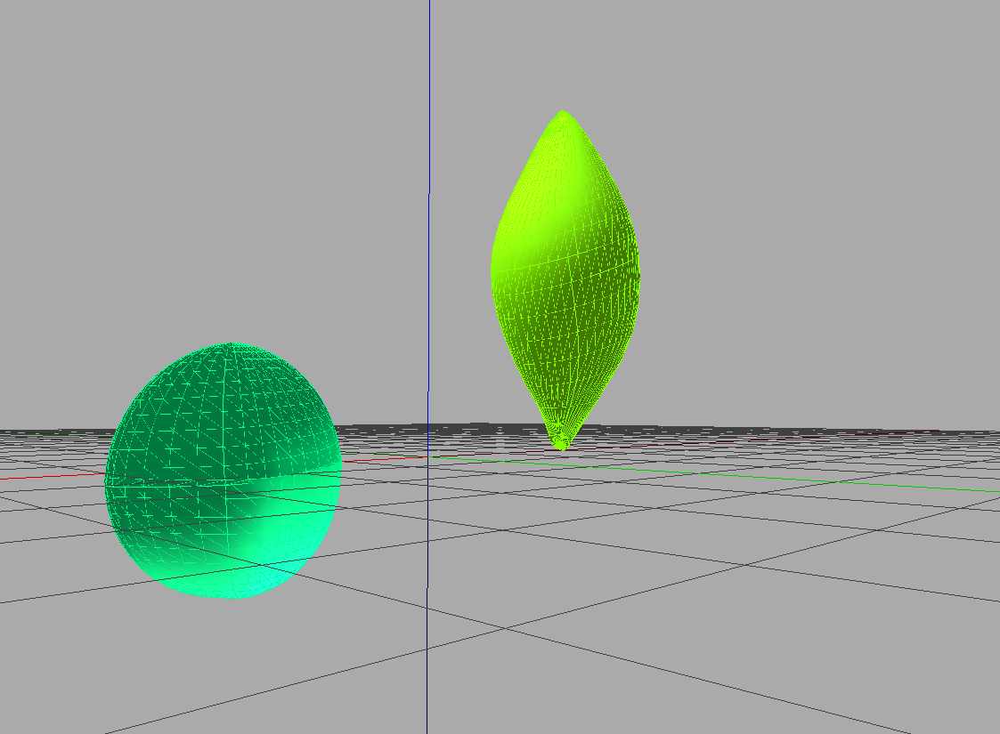

Solution for Generalized Cylinder
---------------------------------

To get some branches with :class:`Extrusion <openalea.plantgl.scenegraph._pglsg.Extrusion>`, here is the python script :

.. literalinclude:: solutions_python/branches.py

To get the result : 

.. image:: ../_images/branches.png
    :width: 40%
    :align: center

We made a circle as the 2D form to extrude, a 3D profile with :class:`NurbsCurve <openalea.plantgl.scenegraph._pglsg.NurbsCurve>`, we indicated a set of scales for each control point of the profile, and :class:`extruded <openalea.plantgl.scenegraph._pglsg.Extrusion>` according to those parameters.

Solution for Positioning Objects
--------------------------------

The python script to get a tree with leaves of same size is :

.. literalinclude:: solutions_python/tree1.py 

for the result :

The python script to get a tree with leaves of decreasing size is :

.. literalinclude:: solutions_python/tree2.py 

for the result :

.. image:: ../_images/tree2.png
    :width: 40%
    :align: center

The python script to get a tree with leaves of same size along a bowing trunk is :

.. literalinclude:: solutions_python/tree3.py 

for the result :

.. image:: ../_images/tree3.png
    :width: 40%
    :align: center
